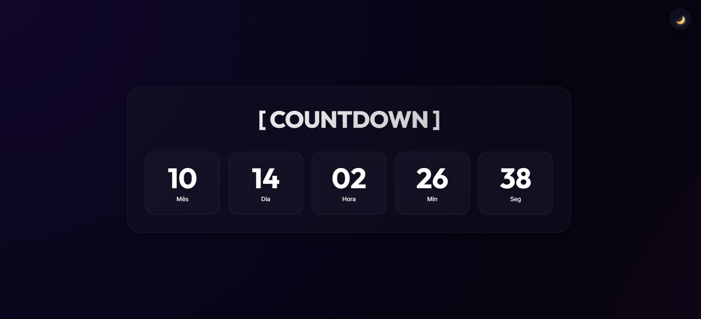

# ⏳ Premium Countdown Timer

## 🎯 Objetivo do Aplicativo
Este é um aplicativo de contagem regressiva de alta precisão e estética premium, projetado para oferecer uma experiência visual imersiva tanto em desktops quanto em dispositivos móveis.

Seu objetivo principal é rastrear o tempo restante até um evento específico (como o Ano Novo) com precisão de milissegundos, apresentando os dados através de uma interface moderna baseada em **Glassmorphism** e **Dark Mode First**.

---

## 🛠️ Como Foi Construído
O projeto foi desenvolvido utilizando tecnologias web modernas, sem dependências externas pesadas (Vanilla JS), garantindo máxima performance e compatibilidade.

### Tecnologias Principais:

- **HTML5 Semântico**: Estrutura acessível e otimizada para SEO.
- **CSS3 Avançado**: 
  - Variáveis CSS (Custom Properties) para theming instantâneo.
  - **Flexbox & Grid** para layouts responsivos complexos.
  - **Glassmorphism**: Efeitos de desfoque (`backdrop-filter`) e transparência.
  - **Animações**: Keyframes para feedbacks visuais suaves.
  - **Mobile First**: Design adaptativo que elimina scroll em celulares.
- **JavaScript (ES6+)**: Lógica encapsulada e modular.

### Arquitetura Standalone
Para garantir facilidade de uso, toda a lógica complexa foi consolidada em um único arquivo (`app-standalone.js`), permitindo que a aplicação rode diretamente no navegador (`file://`) sem necessidade de um servidor HTTP local.

---

## 🏗️ Manutenibilidade e Arquitetura de Software

A robustez do código é garantida pela aplicação estrita de princípios de engenharia de software modernos. A manutenção deve seguir estas diretrizes:

### 1. 🧩 Padrões de Projeto (POO)
O código é totalmente orientado a objetos, utilizando classes para encapsular responsabilidades:

- **`Container` (DI)**: Gerencia a injeção de dependências, garantindo que os módulos não sejam fortemente acoplados.
- **`ThemeManager`**: Classe dedicada exclusivamente à gestão de temas (Dark/Light) e persistência (`localStorage`).
- **`CountdownService`**: Núcleo lógico que calcula a diferença de tempo. Não sabe nada sobre a UI.
- **`UIController`**: Gerencia o DOM e atualiza a interface. Assina eventos do serviço.

**Para Manutenção:**
- Nunca misture lógica de cálculo com lógica de visualização.
- Use o container para instanciar novas classes.

### 2. 🧱 Princípios SOLID
A arquitetura respeita os 5 princípios para garantir escalabilidade:

- **S (Single Responsibility)**: Cada classe tem apenas uma razão para mudar. Ex: Se mudar a regra de cálculo do tempo, só altere `CountdownService`; se mudar a cor do texto, só altere o CSS ou `ThemeManager`.
- **O (Open/Closed)**: As classes (como `SettingsValidator`) são abertas para extensão (novas regras de validação podem ser adicionadas) mas fechadas para modificação.
- **L (Liskov Substitution)**: As injeções de dependência permitem trocar implementações (ex: um novo `StorageService`) sem quebrar o sistema.
- **I (Interface Segregation)**: Módulos expõem apenas métodos públicos necessários (`init`, `start`), ocultando a complexidade interna.
- **D (Dependency Inversion)**: O `App` não depende de classes concretas diretamente, mas sim das abstrações fornecidas pelo Container DI.

### 3. 🛡️ Segurança (OWASP)
O código implementa práticas de segurança defensiva:

- **Input Validation**: A classe `SettingsValidator` sanitiza todas as configurações antes de serem usadas, prevenindo injeção de dados maliciosos.
- **XSS Prevention**: O uso de `textContent` ou `innerText` é forçado ao atualizar o DOM (em vez de `innerHTML`), neutralizando qualquer tentativa de Cross-Site Scripting.
- **Secure Defaults**: O sistema falha de forma segura (ex: se a data alvo for inválida, o timer para graciosamente em vez de travar o navegador).
- **No Eval**: O código não utiliza `eval()` ou funções perigosas de execução dinâmica.

---

## 📂 Arquivos do Projeto

### Essenciais

- **`index.html`**: Ponto de entrada. Estrutura o layout.
- **`style.css`**: Define a aparência visual, responsividade e animações.
- **`app-standalone.js`**: Contém toda a lógica da aplicação (Classes, DI, Lógica).

### Desenvolvimento (Legado/Referência)

- **`src/`**: Código fonte original modularizado (útil para desenvolvimento escalável futuro).
- **`docs/`**: Documentação detalhada antiga.
- **`script.js`**: Versão legada (não utilizada na build atual).

---

## 🚀 Como Rodar
Basta abrir o arquivo `index.html` em qualquer navegador moderno.

**Desenvolvido com foco em Excelência Técnica e Visual.**
